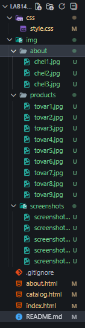
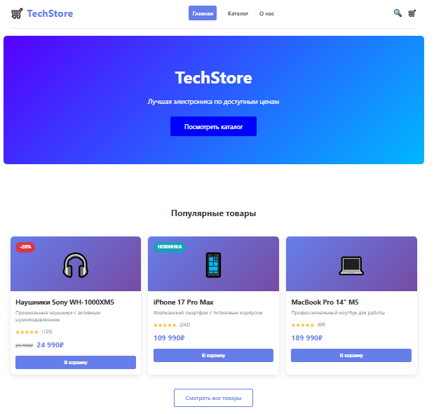
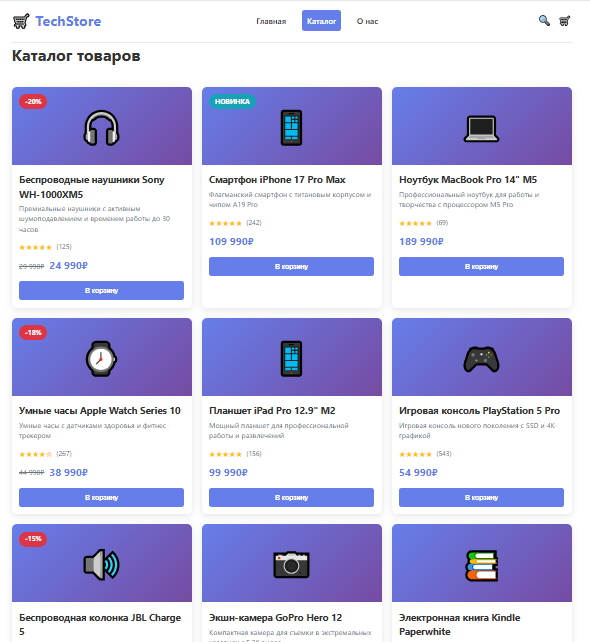
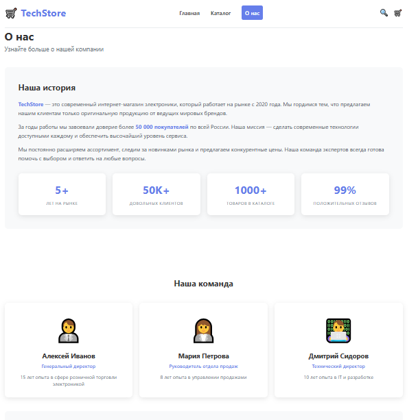

# Лабораторная работа №14-16 - Интернет-магазин "TechStore"

**Студент:** Ханов Владислав Вячеславович  
**Группа:** ИСП-231  
**Дата:** 27.02.2026

## Описание проекта

Многостраничный сайт интернет-магазина электроники "TechStore" с адаптивной вёрсткой.

## Реализованные страницы

- **Главная** — приветственный баннер, популярные товары, преимущества
- **Каталог** — сетка из 9 карточек товаров
- **О нас** — информация о магазине, истории, команде и преимуществах

## Реализованные функции

- Адаптивное навигационное меню с подсветкой активной страницы
- Карточки товаров с hover-эффектами, бейджами скидок и рейтингом
- CSS Grid для каталога (3 колонки на десктопе, 2 на планшете, 1 на мобильном)
- Flexbox для навигации и футера
- Адаптивная вёрстка (desktop/tablet/mobile) с медиа-запросами
- Единая цветовая схема и типографика во всём проекте
- Семантическая HTML5-разметка
- Интерактивные элементы (кнопки, ссылки, карточки) с плавными анимациями

## Технологии

- HTML5
- CSS3 (Flexbox, Grid, Media Queries)
- Git/GitHub

## Структура проекта

## Скриншоты

### Главная страница (desktop)

### Каталог товаров (desktop)

### Страница "О нас" (desktop)

## Как запустить

1. Скачать или клонировать репозиторий
2. Открыть любой HTML-файл в современном браузере
3. Для проверки адаптивности использовать инструменты разработчика (F12)

## Ссылки

- [Репозиторий на GitHub](https://github.com/vvkkdehg?tab=repositories)

---

© 2026 Ханов Владислав
